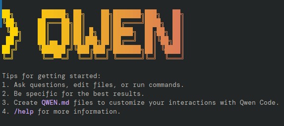
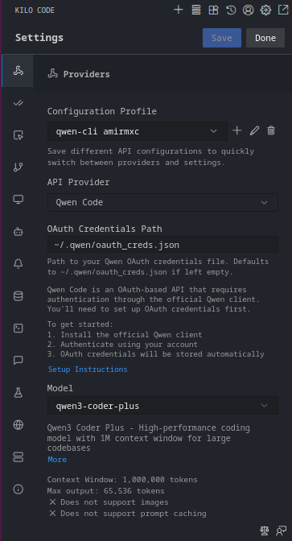

# معرفی یکی از بهترین گزینه های AI Agent Coding های رایگان ( Kilo Code + Qwen CLI)

*روزانه 2000 request رایگان برای AI coding با این ترکیب قدرتمند*

## مقدمه

خسته شدی از assistant های گران AI coding؟ اگه بهت بگم میتونی **روزانه 2000 request رایگان AI coding** با performance سطح enterprise داشته باشی چی؟ توی این راهنمای کامل، بهت نشون میدم چطور بهترین محیط رایگان AI coding رو با **Kilo Code** (یه extension متن‌باز برای VS Code) و **Qwen Code CLI** از Alibaba Cloud راه‌اندازی کنی.

این ترکیب بهت میده:
- ✅ **2000 request در روز** کاملاً رایگان
- ✅ **یک میلیون token context window** برای کار با codebase های بزرگ
- ✅ **60 request در دقیقه** rate limit
- ✅ **هزینه صفر** برای developer های انفرادی
- ✅ قابلیت‌های پیشرفته agentic coding

## چی یاد میگیری

تا آخر این آموزش، یه setup حرفه‌ای AI coding خواهی داشت که با solution های پولی مثل GitHub Copilot یا Claude رقابت میکنه، ولی بدون اینکه یه ریال خرج کنی. بریم شروع کنیم!

## پیش‌نیازها

قبل از شروع، مطمئن شو که اینها رو داری:
- **Node.js نسخه 20 یا بالاتر** روی سیستمت نصب باشه
- **Visual Studio Code** (VS Code) نصب باشه
- یه **اکانت Google** یا ایمیل برای ثبت‌نام توی Qwen.ai
- آشنایی ابتدایی با command line

## قسمت اول: درک ابزارها

### Qwen Code CLI چیه؟

**Qwen Code CLI** یه ابزار command-line هست که توسط Alibaba Cloud ساخته شده و از Google's Gemini CLI fork شده. دسترسی به مدل‌های قدرتمند Qwen3-Coder رو میده:
- **Qwen Free Coder Plus**: مدل هوشمندتر برای task های پیچیده
- **Qwen Free Coder Flash**: مدل سریع‌تر برای iteration های سریع

بهترین قسمت؟ Alibaba Cloud یه free tier فوق‌العاده سخاوتمندانه داره که برای developer های انفرادی و تیم‌های کوچک عالیه.

### Kilo Code چیه؟

**Kilo Code** یه AI coding assistant متن‌باز برای VS Code هست که بهترین ویژگی‌های ابزارهای محبوب مثل Roo Code و Cline رو ترکیب کرده. ارائه میده:
- تولید و تکمیل کد پیشرفته
- automation کارها
- پیشنهادهای context-aware
- پشتیبانی از چندین AI provider
- رابط کاربری تمیز و شهودی

## قسمت دوم: نصب Qwen Code CLI




### مرحله اول: نصب Global Qwen Code

terminal رو باز کن و اینو اجرا کن:

```bash
npm install -g @qwen-code/qwen-code@latest
```

این آخرین نسخه Qwen Code CLI رو به صورت global روی سیستمت نصب میکنه.

### مرحله دوم: Terminal رو Restart کن

بعد از نصب، terminal رو ببند و دوباره باز کن تا مطمئن بشی همه environment variable ها درست load شدن.

### مرحله سوم: Qwen Code رو اجرا کن

فقط تایپ کن:

```bash
qwen
```

خواهی دید که Qwen شروع شده ولی نیاز به authentication داره.

### مرحله چهارم: احراز هویت با Qwen OAuth

وقتی برای authentication method ازت سوال شد، **Qwen OAuth** رو انتخاب کن. این خیلی مهمه چون:
- OAuth کامل 2000 request در روز بهت میده
- استفاده از OpenAI mode یا روش‌های دیگه ممکنه محدودیت‌های اضافی داشته باشه

فرآیند authentication:
1. وقتی ازت پرسیده شد "Qwen OAuth" رو انتخاب کن
2. browser تو qwen.ai باز میشه
3. روی "Continue with Google" کلیک کن (یا اکانت جدید بساز)
4. application رو authorize کن
5. به terminal برگرد

وقتی authentication موفق باشه، terminal دیگه رفتار عجیب نخواهد داشت و به صورت عادی پاسخ میده.

### مرحله پنجم: راه‌اندازی رو تأیید کن

نصبت رو با این سوال تست کن:

```
Which model are you?
```

پاسخ باید "Qwen 3 Coder Plus" یا چیزی مشابه رو نشون بده.

### مرحله ششم: فایل credentials رو چک کن

**مهم:** به home directory برو و تأیید کن که فایل credentials ساخته شده:

- **macOS/Linux**: `~/.qwen/credentials`
- **Windows**: `%USERPROFILE%\.qwen\credentials`

این فایل authentication token های تو رو داره و برای مراحل بعدی ضروریه.

## قسمت سوم: نصب و پیکربندی Kilo Code

### مرحله اول: نصب Extension Kilo Code

1. Visual Studio Code رو باز کن
2. به Extensions marketplace برو (Ctrl/Cmd + Shift + X)
3. "Kilo Code" رو جستجو کن
4. روی "Install" روی Kilo Code extension توسط kilocode کلیک کن

### مرحله دوم: موقعیت Kilo Code رو برای workflow بهتر تغییر بده

**نکته حرفه‌ای:** به جای اینکه Kilo Code رو توی sidebar سمت چپ بذاری:
1. آیکون Kilo Code رو توی Activity Bar پیدا کن
2. اونو به سمت راست صفحه بکش
3. این کار یه panel اختصاصی برای تعاملات AI میسازه بدون اینکه file explorer تو رو مسدود کنه

### مرحله سوم: پیکربندی Kilo Code با Qwen

1. روی آیکون Kilo Code کلیک کن تا panel باز بشه
2. به Settings برو (آیکون چرخ‌دنده)
3. روی "Create New Configuration Profile" کلیک کن
4. اسمش رو "Qwen Code" بذار (یا هر اسم دلخواهی)
5. روی "Create Profile" کلیک کن

### مرحله چهارم: راه‌اندازی API Configuration




**انتخاب حیاتی:** دو گزینه داری:
- ❌ **OpenRouter**: محدود به ~50 request در روز توی free tier
- ✅ **Qwen Code**: کامل 2000 request در روز

همیشه پیکربندی مستقیم Qwen Code رو انتخاب کن تا از حداکثر مزایا بهره‌مند بشی!

این‌طور پیکربندی کن:
1. "Qwen Code" رو به عنوان نوع provider انتخاب کن
2. توی فیلد credentials، مسیر فایل credentials رو وارد کن:
   - **macOS/Linux**: `~/.qwen/credentials`
   - **Windows**: `%USERPROFILE%\.qwen\credentials`

### مرحله پنجم: مدلت رو انتخاب کن

بین اینها انتخاب کن:
- **Qwen Free Coder Plus**: بهترین برای logic پیچیده و problem-solving
- **Qwen Free Coder Flash**: بهترین برای completion های سریع و task های ساده

هر دو کاملاً رایگان با همون محدودیت‌های سخاوتمندانه!

### مرحله ششم: ذخیره و فعال‌سازی

1. روی "Save" کلیک کن تا configuration ذخیره بشه
2. روی "Done" کلیک کن تا از settings خارج بشی
3. توی Kilo Code به "Ask Mode" برو
4. profile "Qwen Code" رو از provider dropdown انتخاب کن

## قسمت چهارم: استفاده از AI Coding Assistant

### استفاده پایه

1. **سوال پرسیدن**: سوالات coding رو مستقیماً توی panel Kilo Code تایپ کن
2. **تولید کد**: function ها، class ها یا برنامه‌های کامل درخواست کن
3. **بررسی کد**: کد رو paste کن و برای بهبودها یا رفع bug پیشنهاد بخواه
4. **توضیحات**: توضیحات کاملی از کد پیچیده بگیر

### نمونه Workflow ها

#### تست سریع
بپرس: "What model are you?"

باید ببینی:
- نام مدل (Qwen Free Coder Plus/Flash)
- Context window: 1,000,000 token
- اطلاعات قیمت نداره (چون رایگانه!)

#### نمونه تولید کد
```
Create a Python function that sorts a list of dictionaries by multiple keys
```

#### نمونه debugging
```
This JavaScript function isn't working correctly. Can you help me fix it?
[paste your code]
```

### مدیریت Context Window

در حالی که مدل یه context window یک میلیون token رو تبلیغ میکنه، به خاطر داشته باش:
- **محدودیت عملی**: برای بهترین performance زیر 400,000 token بمون
- مدل‌ها ممکنه با context های خیلی بزرگ شروع به hallucination یا فراموش کردن دستورالعمل‌ها کنن
- استفاده token هات رو توی رابط Kilo Code monitor کن

## قسمت پنجم: نکات پیشرفته و بهترین practice ها

### ۱. تعویض بین مدل‌ها

- از **Flash** استفاده کن برای:
  - completion های سریع
  - refactoring ساده
  - توضیحات پایه

- از **Plus** استفاده کن برای:
  - الگوریتم‌های پیچیده
  - تصمیمات معماری
  - بررسی کد کامل

### ۲. مدیریت Free Tier

- **2000 request در روز** نیمه‌شب reset میشه (وقت محلی تو)
- **60 request در دقیقه** از سوء استفاده جلوگیری میکنه ولی coding مداوم رو میده
- نیاز به شمردن token نیست - request ها شمرده میشن

### ۳. رفع مشکلات رایج

**مشکلات Authentication:**
- مطمئن شو که از Qwen OAuth استفاده میکنی، نه OpenAI mode
- چک کن که فایل credentials وجود داره و permission های درست داره

**مدل پاسخ نمیده:**
- اتصال اینترنتت رو تأیید کن
- چک کن که به rate limit نرسیده باشی (60 req/min)
- در صورت نیاز VS Code رو restart کن

**مشکلات مسیر Windows:**
- حتی توی Windows از forward slash استفاده کن: `C:/Users/YourName/.qwen/credentials`
- یا از environment variable استفاده کن: `%USERPROFILE%\.qwen\credentials`

### ۴. بیشینه کردن بهره‌وری

- **از prompt های مشخص استفاده کن**: واضح بگو چی میخوای
- **context بده**: snippet های کد مربوطه رو شامل کن
- **سریع iterate کن**: از Flash برای prototype سریع استفاده کن، بعد Plus برای refinement
- **template ذخیره کن**: برای کارهای رایج prompt template بساز

## قسمت ششم: مقایسه با solution های دیگه

| ویژگی | Qwen + Kilo Code | GitHub Copilot | Claude Code | Cursor |
|---------|------------------|----------------|-------------|---------|
| **هزینه ماهانه** | رایگان | $10-19 | $20+ | $20 |
| **Request های روزانه** | 2,000 | نامحدود* | محدود | محدود |
| **Context Window** | 1M token | 8k token | 200k token | متغیر |
| **Open Source** | بله (Kilo Code) | نه | نه | نه |
| **پشتیبانی IDE** | VS Code | چندتا | Terminal | IDE سفارشی |

*GitHub Copilot محدودیت‌های نرم و throttling داره

## نتیجه‌گیری

تبریک! حالا یه AI coding assistant درجه حرفه‌ای داری که کاملاً رایگانه. ترکیب free tier سخاوتمندانه Qwen Code CLI و ویژگی‌های قدرتمند Kilo Code بهت قابلیت‌هایی میده که با خیلی از solution های پولی برابری میکنه یا حتی ازشون بهتره.

### نکات کلیدی:
- ✅ 2000 request رایگان در روز حتی برای development تمام‌وقت کافیه
- ✅ context window یک میلیون token حتی codebase های بزرگ رو handle میکنه
- ✅ Kilo Code رابط بهتری نسبت به ابزار‌های فقط terminal داره
- ✅ توی هیچ ecosystem ای قفل نیستی - همه چیز open source هست

### بعدش چی؟

1. **تجربه کن** با سبک‌های مختلف prompt تا ببینی کدوم بهتر کار میکنه
2. **کشف کن** ویژگی‌های پیشرفته Kilo Code مثل task automation
3. **عضو شو** community Kilo Code برای نکات و آپدیت‌ها
4. **به اشتراک بذار** این راهنما رو با developer های دیگه‌ای که میتونن از AI coding رایگان بهره‌مند بشن

به خاطر داشته باش: این free tier تبلیغاتی هست و ممکنه آینده تغییر کنه، پس تا هست ازش استفاده کن!

---

*این راهنما بهت کمک کرد؟ برای آموزش‌های بیشتر در مورد AI-assisted development و ابزارهای open-source دنبال کن. Happy coding!*
